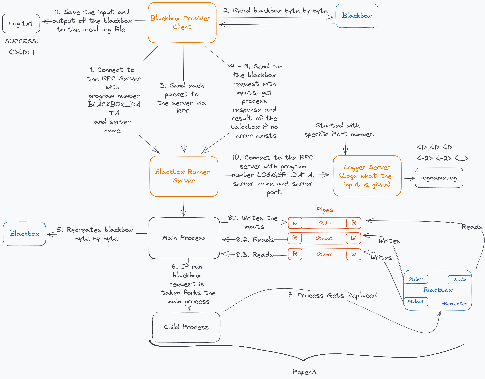
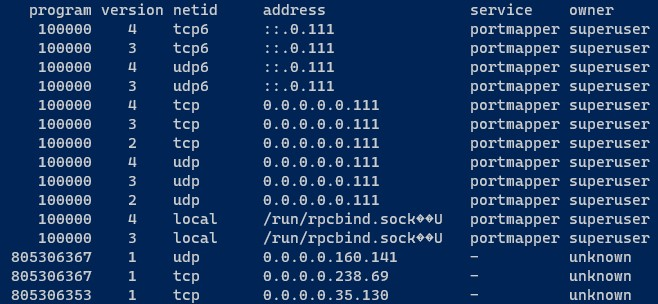
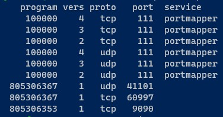

[![Contributors][contributors-shield]][contributors-url] [![Forks][forks-shield]][forks-url] [![Stargazers][stars-shield]][stars-url] [![Issues][issues-shield]][issues-url]

<!-- PROJECT LOGO -->
<br/>
<p align="center">
    
  <h1 align="center">Uploading Binary File with using RPC and rpcgen</h1>
  <p align="center">
    Uploading and running a binary blackbox file using Remote Procedure Call with the help of rpcgen. 
    <br/>
    <a href="https://youtu.be/0TlZ10MsEyc">Watch Video</a>
  </p>
   <p align="center">
    Index
    <br/>
    <a href="#About-the-Project">About the Project</a>
    ·
    <a href="#The-Solution">Getting Started</a>
    ·
    <a href="#Remote Prodecure Call (RPC)">Remote Prodecure Call</a>
      ·
    <a href="#Popen3)">Popen3</a>
  </p>
</p>

# About the Project

This project involves a blackbox, which is a binary file whose internal operations are unknown. It receives two inputs from stdin and produces an output via either stdout or stderr.

The project also includes a server whose purpose is to execute the blackbox provided by us and transmit the results using an RPC to establish communication between the blackbox runner server and the blackbox provider client.

Furthermore, there is a logger server that logs the messages transmitted by the server to a predefined log file.

This project provides examples related to configuring the RPC, generating code for the RPC using rcpgen, creating a child process and transmitting messages via pipes using stdin, stderr, and stdout, specifying a port for the RPC server, resolving an IP address from a server name, and transmitting a binary file byte by byte and recreating it on the other end.

## How it Works


# Getting Started

## Prerequisites
To be able to use and check the information related to the RPC in the Linux, first you have to install it via the command.
- `apt-get install rpcbind`

Use the command `rpcinfo` to check if the installation is done properly. 

To be able the build the code in Cmake you must install it via the command.
- First type the command to get the gcc compiler.
  - `sudo apt install build-essential`
- Later type the command. 
  - `sudo apt-get -y install cmake`

## How to Build
To build the blackbox-provider-client, blackbox-runner-server and logger-server, 
- Go to the `./build` directory. 
- Type the command `cmake ..`
- Type the command `cmake --build .`
- The executables are located at the ./bin directory. You can refer to [How to Run](#How-to-Run) section for running the executables.

To build the blackbox. 
- Go to the `./blackbox` directory.
- Type the command `gcc -o blackbox blackbox.c`

## How to Run
- Start the RCP using the command given. 
  - `sudo /etc/init.d/rpcbind start`
- Check if the RCP is running using with the command given.
  - `rpcinfo`
- Open three seperate terminals.
- In the first terminal, 
  - Go to the directory named /blackbox-runner-server/bin
  - Start the blackbox runner server by typing the command below,
  - `./server_main <logger_server_name> <logger_server_port>`
  - Ex: ./server_main Localhost 9090
- In the second terminal,
  - Go to the directory named /logger-server/bin
  - Start the logger server by typing the command given below,
  - `./logger_main <log_file_name> <logger_server_port>`
  - Logger server port will determine the port that will server be listening.
  - Ex: ./logger_main log_file.log 9090
- In the third terminal,
  - Go to the directory named /blackbox-provider-client/bin
  - Send the blackbox that you want to run on the server by typing the command below,
  - The path should be exact path for the blackbox.
  - `./client_main <blackbox_path> <logger_file_name> <blackbox_runner_server_name`
  - Ex: `./client_main /mnt/c/projects/blackbox-runner-project/blackbox/blackbox local_log.txt Localhost`

# Remote Prodecure Call (RPC)
## Introduction to RPC
RPC (Remote Procedure Call) is a protocol used for communication between client and server applications. It allows a client program to execute a function or procedure on a remote server as if it were executing locally. The idea behind RPC is to hide the details of the network communication and present the client and server applications with an interface that looks like a normal function call.

The RPC protocol is based on the eXternal Data Representation (XDR) protocol, which defines a standard way of representing data in remote communications. XDR is responsible for converting the parameters and results of each RPC service provided.

In order for communicating programs to exchange message data, RPC requires the use of a lower-level transport protocol, such as Transmission Control Protocol/Internet Protocol (TCP/IP) or User Datagram Protocol (UDP).

RPC is commonly used in distributed systems, where a client application running on one machine needs to access services provided by a server application running on another machine, for example different workstations in a network. 

## Understanding rpcinfo
`rpcinfo` is a command-line utility that reports the status of Remote Procedure Call (RPC) servers.
When you run the `rpcinfo` you will see a result as below, 



In the last three entries you can see our services that defined by our program numbers in .x files as a hex. For example for the logger we defined, 
`0x2ffffff1` that is converted as `805306353`.

You can check if the service is working by using the command given below,
`rpcinfo -T tcp <DESKTOP_NAME> 805306353`. That will print the message such as *program 805306353 version 1 ready and waiting.*

If you use the command given `rpcinfo -p` you will see the port information such as, 



At the last three entries you can see the ports, for the provider server because we dit not provide it, it is given by the portmapper as a default behavior. For the logger it is shown as 9090 because we binded it with that port specifically. 


## Generating Code with rpcgen
You are not required to generate code with rpcgen to run the project. This section is just for information.

rpcgen is a tool that is used to generate client and server code for RPC in C. It takes as input an IDL (Interface Definition Language) file that describes the functions and data structures that will be used in the RPC, and it generates code that can be used to call the functions remotely and handle the communication between the client and server. These files ends with the .x suffixes. 

Use `rpcgen blackbox_data.x` command the generate the files from the template file.

**blackbox_data.x** will create these files, 
- **blackbox_data.h:** Actual declarations in C, based on your .x file. Will be used by both server and client. 
- **blackbox_data_xdr.c:** Code to convert your data structures for network transmission. Will be used by both server and client.
- **blackbox_data_svc.c:** Implements main() for the server. Handles listening for incoming RPCs and dispatching control appropriately. Will be used only by server.
- **blackbox_data_clnt.c:** Functions the client can call to issue RPCs. Will be used by only client.

For the client, functions are already defined, you have to write the main and call the functions. 
- `main.c` in the `blackbox-provider-client` is an example for that.

For the server, main is already there, you have to write the functions itselfs. 
- `blackbox_data_proc.c` in the `blackbox-runner-server` is an example for that.
- Names ending in "`_svc`" are prototypes for the server functions we need to fill in.

## How to use it in code
**For client side**, 
```C
cl = clnt_create(argv[1], PRINTER, PRINTER_V1, "tcp");
```
- `argv[1]` -> Hostname. Localhost in our case.
- `PRINTER` -> Program ID. 
- `PRINTER_V1` -> Program Version.

In the file named `blackbox_data_clnt.c` you can see the function prototype that is auto generated by the rpcgen. 
- `blackbox_response *run_blackbox_1(blackbox_run_info *argp, CLIENT *clnt)`

In the `main.c` or in any other .c file you can call the function that will call the RPC. 
- `blackbox_response *my_blackbox_response = run_blackbox_1(&my_blackbox_info, client);`

**For the server side**, you are required to implement given function below.
- `blackbox_response *run_blackbox_1_svc(blackbox_run_info *p_blackbox, struct svc_req *req)`

Note that the response is pointer. You have to declare your result as a global, and return it to be able RPC send it. If you declare it is a local variable, because of the scope that variable will be deleted and RPC will not be able to send it. 
```C
blackbox_response g_blackbox_response;
return &g_blackbox_response;
```
# Popen3
Because Popen3 is such a critical feature of this project, I wanted to mention it here. 

This function first creates pipes and forks the current process, then duplicates write ends of the pipes to the stdout, stderr, duplicates read end to the stdin. Repeats the same operation for the main process but this time, stdout and stderr are the read ends and stdin is the write end. 

Afterwards by calling the execl in the child process, the execl replaces the current process image with a new process image by invoking the shell. 

That is how we are running the blackbox, we create a process, connect the std inputs and outputs with the main process for communication and run the blackbox by invoking the shell like we do in terminal by writin the code ./blackbox

# License
This project is licensed under GNU General Public License v3.0.
# Acknowledgments
I have used many sources but the sources below are the best examples in their areas which helped me to finish this project. 
- [Understanding the Pipe System Call (popen3 example in C)](https://youtu.be/8AXEHrQTf3I)
- [Writing Remote Procedural Calls (RPCs) in C](https://www.cprogramming.com/tutorial/rpc/remote_procedure_call_start.html)
- [rpcgen Tutorial](https://docs.oracle.com/cd/E19683-01/816-1435/rpcgenpguide-21470/index.html)
- Excalidraw for the diagram.